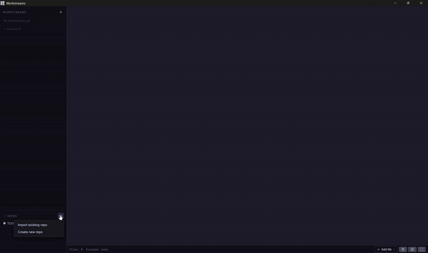

# Workstreams

> An Integrated Agentic Coding Envionment for **Copilot CLI** — manage projects, persist
> sessions, embed terminals, browse/edit code, and review diffs side-by-side.

## Why?

When you live in **Copilot CLI**, every project becomes a fistful of terminal
tabs: one for the agent, one for `git`, one for logs, one for a quick
markdown preview. Workstreams turns that mess into a persistent,
project-aware workspace:

- A **sidebar** of projects and their workstreams (branches / worktrees).
- A **tiling canvas** per workstream that adapts as you add tiles.
- **Tiles for the things you actually do**: Copilot sessions, terminals,
  repo browser, file editor, doc viewer, scratch workbench.
- **Everything persists**: layouts, terminal scrollback, open files, view
  state. Crash the app — pick up where you left
  off.

## Highlights

- 🪟 **Tiling that adapts to count** — 1 fullscreen, 2 split, 3 focus+stack,
  4 grid, 5+ focus+grid. Add a yellow-bordered fullscreen flip with `Alt+F`.
- 🤖 **First-class Copilot CLI sessions** — one linked session per
  workstream, with live activity indicator + bell on idle. Configurable CLI
  command (default `agency copilot --yolo`; switch to `copilot --yolo` for
  the public CLI).
- 🗂️ **Built-in repo browser** — Files / Diff / Log / Hooks tabs. Diff has
  split / unified toggle. Audio, images, and SQLite databases preview inline.
  Git hooks open in a syntax-highlighted editor with inline editing.
- ✏️ **Editable Monaco** — Ctrl+S + 10 s auto-save, external-modification
  detection, conflict diffs.
- 📝 **Markdown with extras** — GFM, syntax-highlighted code, on-disk image
  references, inline Mermaid diagrams with zoom / pan, inter-file links.
- 🖥️ **Present markdown as slides** — any `.md` has a third "Slides" mode,
  picked from a three-way Edit / Preview / Slides selector: split on `---`,
  navigate with arrows / Space / click, fullscreen with `Alt+F`.
- 💬 **Inline file comments** — Per-workstream comments anchored to line
  ranges; persisted in SQLite.
- ⌨️ **Keyboard-driven** — `Alt+<letter>` for every tile type, `Alt+Arrows`
  to move focus, `Alt+S` for side-by-side compare.
- 💾 **Survives restarts** — workstreams, tile layouts, scrollback, opened
  files, view state.
- ⚡ **Non-blocking worktree ops** — creating or archiving a workstream runs
  its git work (pull, worktree add/remove) on a background thread, so the UI
  never freezes. The sidebar row itself shows live provisioning / archiving
  progress; failures surface inline with Retry / Discard.

Full feature reference: [docs/features-detailed.md](docs/features-detailed.md).

## Install

Pre-built Windows installers are attached to every
[release](https://github.com/alejandroechev/workstreams/releases) (NSIS
`.exe` or MSI). Linux / macOS are not currently shipped — build from source
([contributor guide](docs/contributor-guide.md#setup)).

## Tour

1. Click `+` in the sidebar → **Import existing repo** (pick a folder) or
   **Create new repo** (scaffold + optional `gh repo create`).
2. The workstream opens with an empty tile canvas. Add tiles via the
   `+ Add tile` menu or shortcuts:
   - `Alt+C` Copilot session
   - `Alt+R` Repo Explorer
   - `Alt+T` Terminal
   - `Alt+M` Session Meta
   - `Alt+B` Workbench
3. Navigate between tiles with `Alt+Arrows`. Fullscreen the focused one
   with `Alt+F`.
4. Open the settings dialog (gear icon) to tune font sizes, terminal scroll
   speed, and the Copilot command.

## Keyboard shortcuts

All app-level commands use **Alt** to avoid conflicts with terminal
(`Ctrl+C/V/...`) and Monaco (`Ctrl+F/P/...`) shortcuts.

| Key | Action |
|-----|--------|
| `Alt+C` | New Copilot session tile |
| `Alt+T` | New terminal tile (PowerShell) |
| `Alt+W` | New terminal tile (WSL) |
| `Alt+R` | New Repo Explorer tile |
| `Alt+M` | New Session Meta tile |
| `Alt+B` | New Workbench tile |
| `Alt+Q` | Close focused tile |
| `Alt+F` | Toggle fullscreen for focused tile |
| `Alt+S` | Toggle side-by-side (when exactly 2 tiles are selected) |
| `Alt+Arrows` | Navigate between tiles |
| `Ctrl+S` | Save focused file editor |
| `Ctrl+Shift+V` | Toggle markdown preview / edit (VS Code parity) |
| `Esc` | Unfocus terminal / close modal |

### Mouse interactions

- **Double-click a tile's header bar** to toggle fullscreen for that tile.
- **Shift-click another tile** while one is focused to compare the two
  side-by-side (the focused tile becomes the left pane).

### Present mode (markdown slides)

Any markdown file opened in Repo Explorer, Workbench, or Session Meta can be
presented as a slide deck:

- Use the three-way **mode selector** (Edit / Preview / Slides) in the file
  toolbar to jump straight to any mode in one click (the Slides segment shows
  for markdown only). `Ctrl+Shift+V` still flips preview ⇄ edit.
- Slides are split on `---` thematic breaks. A leading YAML frontmatter block
  is treated as deck config (e.g. `fontScale: 1.5`), not a slide.
- Navigate with `→` / `Space` / `PageDown` (next), `←` / `PageUp` (prev),
  `Home` / `End`, or click the right / left half of the slide. An
  auto-dimming control cluster shows the slide counter and a progress bar.
- `Alt+F` (or double-click the tile header) goes fullscreen; `Esc` exits
  present mode back to preview. Slides render the live editor buffer, so
  editing a slide and flipping back to Present reflects changes immediately.

## Tech stack

| Component | Technology |
|-----------|------------|
| App framework | Tauri v2 (Rust backend + WebView2 frontend) |
| Frontend | React 19 + Vite + TypeScript |
| Terminal | xterm.js + portable-pty (ConPTY) |
| Editor | Monaco Editor |
| Doc viewer | react-markdown + remark-gfm + Mermaid (vendored) |
| Persistence | SQLite (rusqlite) with WAL |
| Theme | Catppuccin Mocha |

## Documentation

- [**Features deep dive**](docs/features-detailed.md) — long-form reference
  for every feature, with screenshots.
- [**Contributor guide**](docs/contributor-guide.md) — setup, commands,
  tests, hooks, CI.
- [**Architecture diagram**](docs/system-diagram.md) — system-level mermaid.
- [**Architecture Decision Records**](docs/adrs/) — design decisions.

## License

MIT — see [LICENSE](LICENSE).
