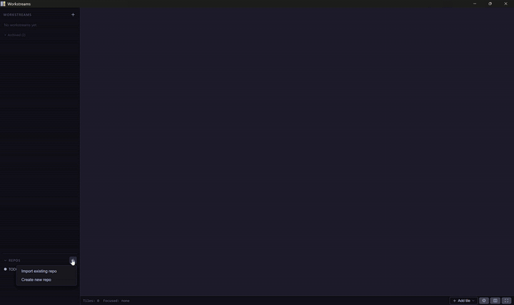

# Workstreams

> An Integrated Agentic Coding Envionment for **Copilot CLI** — manage projects, persist
> sessions, embed terminals, browse/edit code, and review diffs side-by-side.



## Why?

When you live in **Copilot CLI**, every project becomes a fistful of terminal
tabs: one for the agent, one for `git`, one for logs, one for a quick
markdown preview. Workstreams turns that mess into a persistent,
project-aware workspace:

- A **sidebar** of workstreams grouped by what they are doing — **Live** (tiles
  and processes running) and **Idle** (kept, but stopped) — with archived work
  and repo administration tucked out of the way. "Idle" is a runtime fact, not a
  stored status, which is why closed workstreams used to be indistinguishable
  from running ones.
- A **tiling canvas** per workstream that adapts as you add tiles.
- **Tiles for the things you actually do**: Copilot sessions, terminals,
  repo browser, file editor, doc viewer, scratch workbench.
- **Everything persists**: layouts, terminal scrollback, open files, view
  state. Crash the app — pick up where you left
  off.

## Highlights

- 🪟 **Tiling that adapts to count** — 1 fullscreen, 2 split, 3 focus+stack,
  4 grid, 5+ focus+grid. Add a yellow-bordered fullscreen flip with `Alt+F`.
- 🤖 **First-class Copilot CLI sessions** — one linked session per
  workstream, with live activity indicator + bell on idle. Configurable CLI
  command (default `agency copilot --yolo`; switch to `copilot --yolo` for
  the public CLI).
- 🌙 **Close (stop) a workstream** — the row's `⋯` menu has **Close (stop
  processes)**, which tears down a loaded workstream's tiles/terminals (killing
  its PTYs) without archiving it. It stays in the active list and reverts to
  the moon "stopped" indicator, exactly like a workstream that hasn't been
  opened yet this session; selecting it again reloads and respawns everything.
- 📋 **Task board with daily devlog export** — a global board (sidebar →
  **Tasks**), not a tile, because a task may have no workstream and often
  outlives the one it had. Seven columns matching the status glyphs already
  used in a hand-written devlog (⚒️ 👁️ 🧊 🚗 🙋 ✅), **label swimlanes** so a
  long in-progress column stays scannable, an **append-only activity log** per task, and one **free-form Notes**
  field per task — editable multi-line context that lands in the exported page. Cards are **drag-and-drop** between columns (dropping a card back on
  its own column is a no-op, so `🕵️` and `❌` keep their glyph), show their
  **subtasks with individual state** plus a done/total count, and link straight
  to the **workstream** they are attached to. A workstream's `⋯` menu has
  **Create task…**, which opens the board with a task already created, named
  after the workstream, attached to it and selected for renaming. Notes can be
  deleted but never rewritten. **Export** renders the day into your wiki as
  markdown, commits and pushes it — one-way, and it never overwrites a page it
  did not generate. **Preview** shows exactly what would be written without
  writing anything. See [ADR 020](docs/adrs/020-task-board-devlog-export.md).
- 🗂️ **Built-in repo browser** — Files / Diff / Log / Hooks / Search tabs. Diff
  has split / unified toggle, and the **Unstaged** diff is **editable in place**:
  type on the modified side and `Cmd+S` / `Ctrl+S` (or the Save button) writes
  straight to the working file, then re-reads the diff. Inline file comments work there too:
  select modified-side lines and use the comment toggle to create the same
  reviewer↔agent threads shown in the Files tab. A second toggle **hides
  resolved threads** so a heavily-reviewed file shows only what is still open,
  and a comment whose file no longer exists can be deleted from the
  load-failure view. Historical modes (Last commit,
  Branch vs master, or a **custom target branch**) stay read-only and
  uncommentable because their modified side is a past commit, not a file on
  disk. The custom branch picker compares `target...HEAD` and remembers its
  selection per tile. Audio, images, PDFs, and SQLite databases preview inline.
  Git hooks open in a syntax-highlighted editor with inline editing.
- 🔎 **Search all files** — the Search tab (or `Ctrl+Shift+F`) runs a fast
  content search across the repo, respecting `.gitignore`, grouping matches by
  file with highlighted previews; click a result to jump straight to that line.
  Toggle case-sensitive (`Aa`) or regex (`.*`) matching. `Ctrl+P` still does
  filename search. Searches run off the UI thread so they never freeze the app.
  See [ADR 012](docs/adrs/012-repo-content-search.md).
- ✏️ **Editable Monaco** — Ctrl+S + 10 s auto-save, external-modification
  detection, conflict diffs.
- 📝 **Markdown with extras** — GFM, syntax-highlighted code, on-disk image
  references, inline Mermaid diagrams with zoom / pan, inter-file links.
- 🖥️ **Present markdown as slides** — any `.md` has a third "Slides" mode,
  picked from a three-way Edit / Preview / Slides selector: split on `---`,
  navigate with arrows / Space / click, fullscreen with `Alt+F`.
- 💬 **Inline file comments** — Anchor comments to line ranges on any file in
  the Repo Explorer. Comments live in the bound Copilot session's own
  `session.db` with the same reviewer↔agent model as Code Review: the agent
  replies and marks notes addressed with its built-in `sql` tool (guided by the
  `file-comments` skill), and you **reply** in-thread, resolve/reopen, edit, or
  **copy** the whole thread — all inline in the file. A **Comments tab** lists
  every comment in the workstream grouped by file; clicking one opens that file
  and jumps to the anchored line, with stale anchors badged. Threads imported
  from an external review (e.g. the `ado-file-comments` skill) keep the
  **original reviewer's name** rather than being attributed to you, and are
  read-only.
  A linked Copilot session is required.
  See [ADR 009](docs/adrs/009-inline-file-comments.md).
- 🔎 **Local code review** — A diff-first, PR-style review tile for AI-agent
  *or* human-written code, with no ADO round-trips and no MCP. Pick a diff
  source (working tree, last commit, or a branch base), read the real diff,
  comment inline on the modified side, and **edit code in place** in the diff
  (working-tree source). Comments live in the bound Copilot session's own
  `session.db`; the agent reads and replies with its built-in `sql` tool (guided
  by the `code-review` skill) and you pull in the replies with the **Sync**
  button. `Alt+A` opens the Code Review tile.
  See [ADR 014](docs/adrs/014-code-review-tile.md).
- 🐾 **Code walkthrough** *(experimental)* — step through a Rust test's
  **real execution** to understand code, not to debug it. Record once with
  `node scripts/trace-record.mjs --test <name> [--package <crate>]` (drives a
  debug adapter), then
  replay the trace in the app: the walkthrough tile drives a bound Repo
  Explorer, so you get debug order *and* the freedom to wander off and hit
  **Resync**.
  Replay works on any platform. **Recording** needs a debug adapter:
  macOS/Linux use `lldb-dap` (Xcode Command Line Tools or an LLVM install);
  **Windows** uses [CodeLLDB](https://marketplace.visualstudio.com/items?itemName=vadimcn.vscode-lldb)
  (`code --install-extension vadimcn.vscode-lldb`), because it bundles the PDB
  reader an MSVC-toolchain Rust build needs. Point `WORKSTREAMS_DAP_ADAPTER` at
  an adapter in a non-standard location. Recording *from the tile* is macOS-only
  for now — on Windows use the CLI ([ADR 018](docs/adrs/018-code-walkthrough-debugger.md)).
  Test discovery is explicit rather than automatic: enter an optional Cargo
  package (`-p`) and name filter, then press **Load**. It runs in the background
  and does not open a terminal window. The equivalent CLI is
  `node scripts/trace-tests.mjs --manifest-dir <dir> [--package <name>] [--filter <text>]`.
  Because it is a replay, you can also step **backwards**. `Alt+D` opens the
  tile (disabled by default; see the feature flag below); with it focused,
  `↑`/`↓` step, `o` finishes the current function and returns to its caller,
  `Home`/`End` jump to the ends, and `r` resyncs the editor.
  `node scripts/trace-replay.mjs <trace.json>` steps through the same trace in
  a terminal. Traces are stored under the owning Copilot session, not in your
  repo, so they never show up in `git status`. See [ADR 018](docs/adrs/018-code-walkthrough-debugger.md).
- ⌨️ **Keyboard-driven** — `Alt+<letter>` for every tile type, `Alt+Arrows`
  to move focus, `Alt+S` for side-by-side compare.
- 💾 **Survives restarts** — workstreams, tile layouts, scrollback, opened
  files, view state.
- ⚡ **Non-blocking worktree ops** — creating or archiving a workstream runs
  its git work (pull, worktree add/remove) on a background thread, so the UI
  never freezes. The sidebar row itself shows live provisioning / archiving
  progress; failures surface inline with Retry / Discard.

Full feature reference: [docs/features-detailed.md](docs/features-detailed.md).

## Install

Pre-built installers are attached to every
[release](https://github.com/alejandroechev/workstreams/releases):

| Platform | Artifact |
| --- | --- |
| Windows | NSIS `.exe`, `.msi`, or the raw `workstreams-<tag>.exe` |
| macOS (Apple Silicon) | `Workstreams-<tag>-arm64.dmg` or `.app.zip` |

Linux is not currently shipped — build from source
([contributor guide](docs/contributor-guide.md#setup)).

### macOS notes

The macOS build is **experimental** and is *not* code-signed or notarised, so
Gatekeeper blocks the first launch. Either right-click the app → **Open** →
**Open**, or clear the quarantine flag:

```bash
xattr -dr com.apple.quarantine /Applications/Workstreams.app
```

Only Apple Silicon (`aarch64`) is built; Intel Macs would need a separate
`x86_64-apple-darwin` target. Terminal tiles run your login shell (`$SHELL`,
falling back to `/bin/zsh`) instead of PowerShell, and the WSL tile is hidden.
The Copilot CLI must be installed and on your `PATH`.

Apps launched from the Dock, Finder, or Spotlight inherit launchd's minimal
`PATH` (`/usr/bin:/bin:/usr/sbin:/sbin`) and never read `~/.zshrc`, which would
hide `copilot`, `agency`, `node` and Homebrew binaries from every tile. On a
GUI launch Workstreams detects this and asks your login shell for its `PATH`
once, then uses it for spawned tiles — so no `PATH` setup is needed. Because
that value is snapshotted at startup, **restart the app after editing your
shell profile**. See [ADR 017](docs/adrs/017-macos-gui-launch-path.md).

## Tour

1. Open **Repos** from the sidebar footer → **Import existing repo** (pick a
   folder) or **Create new repo** (scaffold + optional `gh repo create`). Repo creation
   runs in the background with per-step progress, so the app stays responsive
   during the (network-bound) remote create + push.
2. The workstream opens with an empty tile canvas. Add tiles via the
   `+ Add tile` menu or shortcuts:
   - `Alt+C` Copilot session
   - `Alt+R` Repo Explorer
   - `Alt+T` Terminal
   - `Alt+M` Session Meta
   - `Alt+B` Workbench
   - `Alt+A` Code Review
3. Navigate between tiles with `Alt+Arrows`. Fullscreen the focused one
   with `Alt+F`.
4. Open the settings dialog (gear icon) to tune font sizes, terminal scroll
   speed, the Copilot command, and rendering. Terminals use the reliable DOM
   renderer by default; for extra speed you can uncheck **Disable GPU (WebGL)
   rendering** to switch terminals to the GPU renderer. If a GPU-rendered
   terminal ever goes **black** and won't recover, re-enable the setting to fall
   back to the DOM renderer (which never blanks). Terminals also self-recover
   from GPU context loss and permanently drop to the DOM renderer after repeated
   losses.
5. The Copilot command is global by default, but each **repo** can override it:
   open **Repos** from the sidebar footer, pick a repo and set a **Copilot
   command** (blank = inherit the global). Every workstream in that repo then
   spawns Copilot sessions with the repo's command. Handy when one repo needs a
   different launcher (e.g. `copilot --yolo`) than the rest.

## Keyboard shortcuts

All app-level commands use **Alt** to avoid conflicts with terminal
(`Ctrl+C/V/...`) and Monaco (`Ctrl+F/P/...`) shortcuts.

| Key | Action |
|-----|--------|
| `Alt+C` | New Copilot session tile |
| `Alt+T` | New terminal tile (PowerShell) |
| `Alt+W` | New terminal tile (WSL) |
| `Alt+R` | New Repo Explorer tile |
| `Alt+M` | New Session Meta tile |
| `Alt+B` | New Workbench tile |
| `Alt+A` | New Code Review tile |
| `Alt+Q` | Close focused tile |
| `Alt+F` | Toggle fullscreen for focused tile |
| `Alt+S` | Toggle side-by-side (when exactly 2 tiles are selected) |
| `Alt+Arrows` | Navigate between tiles |
| `Ctrl+S` | Save focused file editor |
| `Ctrl+P` | Filename search (Repo Explorer) |
| `Ctrl+Shift+F` | Content search — "search all files" (Repo Explorer) |
| `Ctrl+Shift+V` | Toggle markdown preview / edit (VS Code parity) |
| `Esc` | Unfocus terminal / close modal |

### Mouse interactions

- **Double-click a tile's header bar** to toggle fullscreen for that tile.
- **Shift-click another tile** while one is focused to compare the two
  side-by-side (the focused tile becomes the left pane).

### Present mode (markdown slides)

Any markdown file opened in Repo Explorer, Workbench, or Session Meta can be
presented as a slide deck:

- Use the three-way **mode selector** (Edit / Preview / Slides) in the file
  toolbar to jump straight to any mode in one click (the Slides segment shows
  for markdown only). `Ctrl+Shift+V` still flips preview ⇄ edit.
- Slides are split on `---` thematic breaks. A leading YAML frontmatter block
  is treated as deck config (e.g. `fontScale: 1.5`), not a slide.
- Navigate with `→` / `Space` / `PageDown` (next), `←` / `PageUp` (prev),
  `Home` / `End`, or click the right / left half of the slide. An
  auto-dimming control cluster shows the slide counter and a progress bar.
- `Alt+F` (or double-click the tile header) goes fullscreen; `Esc` exits
  present mode back to preview. Slides render the live editor buffer, so
  editing a slide and flipping back to Present reflects changes immediately.

## Tech stack

| Component | Technology |
|-----------|------------|
| App framework | Tauri v2 (Rust backend + WebView2 frontend) |
| Frontend | React 19 + Vite + TypeScript |
| Terminal | xterm.js + portable-pty (ConPTY) |
| Editor | Monaco Editor |
| Doc viewer | react-markdown + remark-gfm + Mermaid (vendored) |
| Persistence | SQLite (rusqlite) with WAL |
| Theme | Catppuccin Mocha |

## Documentation

- [**Features deep dive**](docs/features-detailed.md) — long-form reference
  for every feature, with screenshots.
- [**Contributor guide**](docs/contributor-guide.md) — setup, commands,
  tests, hooks, CI.
- [**Architecture diagram**](docs/system-diagram.md) — system-level mermaid.
- [**Architecture Decision Records**](docs/adrs/) — design decisions.

## License

MIT — see [LICENSE](LICENSE).
