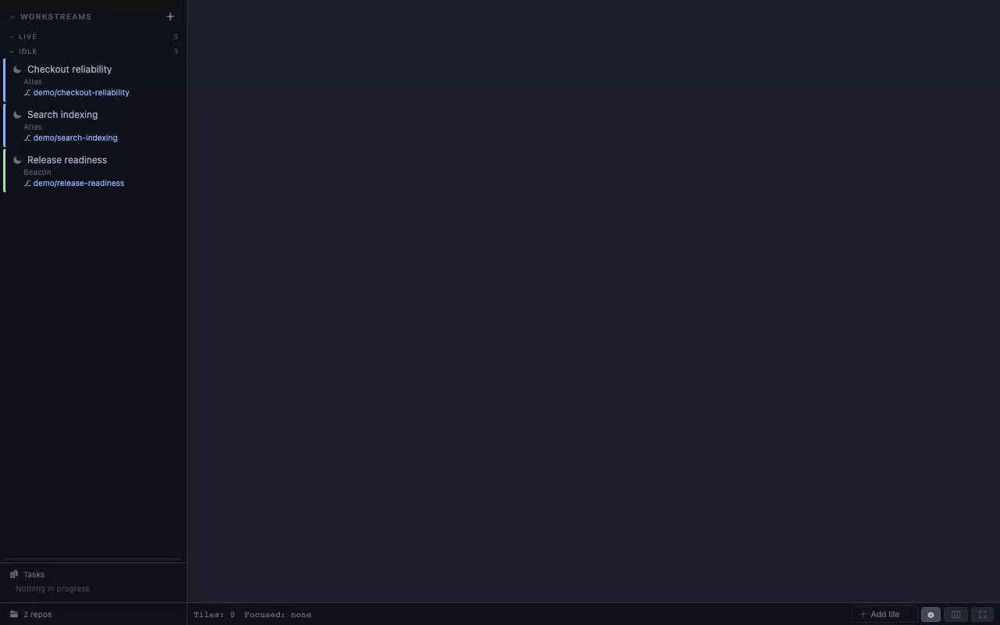
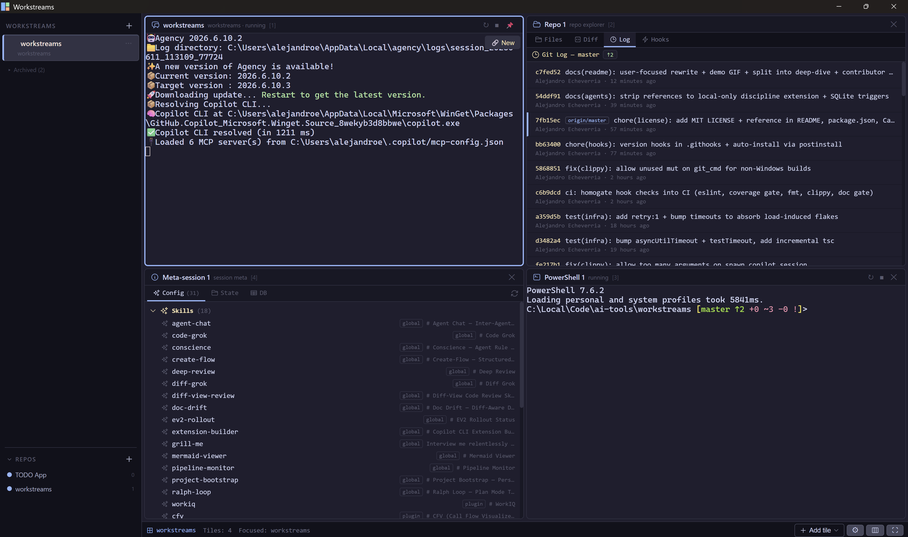
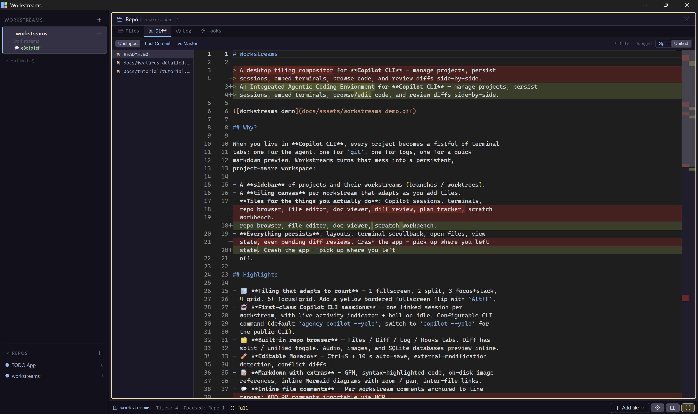

# Workstreams

> A desktop workspace for parallel Copilot CLI agents — tiling, persistent
> sessions, and verifier-gated goal loops.

[](https://github.com/alejandroechev/workstreams/actions/workflows/ci.yml)
[](https://github.com/alejandroechev/workstreams/releases)
[](LICENSE)

**[Website](https://alejandroechev.github.io/workstreams/)** ·
**[Feature reference](docs/features-detailed.md)** ·
**[Design decisions](docs/adrs/)**

[](docs/assets/demos/overview.webm)

[Watch the WebM recording](docs/assets/demos/overview.webm) ·
[Watch the MP4 recording](docs/assets/demos/overview.mp4) ·
[View the poster](docs/assets/demos/overview.png)

## Why Workstreams?

When you live in Copilot CLI, every project becomes a fistful of terminal tabs:
one for the agent, one for `git`, one for logs, one for a quick markdown
preview. Close the window and it is all gone.

Workstreams keeps the shape of your work. Every project gets a persistent,
project-aware workspace where sessions, layouts, scrollback and open files all
survive a restart — and where the agents you have running stay side by side
instead of buried behind tabs.

## Features

- **Tiling that adapts to count** — 1 fullscreen, 2 split, 3 focus+stack, 4
  grid, 5+ focus+grid. Your agents stay visible instead of stacking up as tabs.
- **Copilot sessions, one per workstream** — a linked session with a live
  activity indicator and a bell when it goes idle. The CLI command is
  configurable globally or per repo.
- **Goal loops that have to prove themselves** — describe an objective in a
  YAML definition and let a bounded orchestrator→worker pipeline run it to
  completion. Every loop must carry deterministic verification, an independent
  evaluator, human approval, or a mix. Runs pin the definition by hash, show a
  measured per-stage time breakdown, and survive a pause-quit-resume.
  [Watch a deterministic Goal Loop run](docs/assets/demos/goal-loop.webm)
  ([MP4](docs/assets/demos/goal-loop.mp4) ·
  [poster](docs/assets/demos/goal-loop.png)).
- **Local code review, no round-trips** — a diff-first, PR-style tile for agent
  or human code. Comment inline, edit code in place, and the agent replies in
  the same threads. No Azure DevOps, no MCP.
  [Watch a local working-tree review](docs/assets/demos/local-code-review.webm)
  ([MP4](docs/assets/demos/local-code-review.mp4) ·
  [poster](docs/assets/demos/local-code-review.png)).
- **Repo browser that edits in place** — Files / Diff / Log / Hooks / Search.
  The unstaged diff is editable directly, audio, images, PDFs and SQLite files
  preview inline, and git hooks open in a real editor.
- **Search that never freezes the app** — `.gitignore`-aware content search
  across the repo, off the UI thread, with regex and case toggles.
- **Task board that writes your devlog** — labels, swimlanes, subtasks and an
  append-only activity log per task, exported to your wiki as a dated markdown
  page that it commits and pushes.
- **Everything persists** — workstreams, tile layouts, terminal scrollback,
  open files and per-tile view state all survive a restart.
- **Keyboard-driven** — `Alt+<letter>` opens any tile type, `Alt+Arrows` moves
  focus, `Alt+S` compares two tiles side by side.
- **Code walkthrough** *(experimental)* — record a Rust test's real execution
  and step through it forwards *and* backwards to understand the code.





Full reference: **[docs/features-detailed.md](docs/features-detailed.md)**.

## Install

Pre-built installers are attached to every
[release](https://github.com/alejandroechev/workstreams/releases):

| Platform | Artifact |
| --- | --- |
| Windows | NSIS `.exe`, `.msi`, or the raw `workstreams-<tag>.exe` |
| macOS (Apple Silicon) | `Workstreams-<tag>-arm64.dmg` or `.app.zip` |

Linux is not shipped yet — build from source
([contributor guide](docs/contributor-guide.md#setup)).

The Copilot CLI must be installed and on your `PATH`.

### macOS

The macOS build is **experimental** and is *not* code-signed or notarised, so
Gatekeeper blocks the first launch. Either right-click the app → **Open** →
**Open**, or clear the quarantine flag:

```bash
xattr -dr com.apple.quarantine /Applications/Workstreams.app
```

Only Apple Silicon (`aarch64`) is built. Workstreams recovers your login
shell's `PATH` on a GUI launch, so tiles, loop verifiers and trace recording
resolve `node`, `cargo` and Homebrew binaries with no setup — but **restart the
app after editing your shell profile**, since the value is snapshotted at
startup. See [macOS environment](docs/features-detailed.md#macos-environment).

## Quick start

1. Open **Repos** from the sidebar footer → **Import existing repo** (pick a
   folder) or **Create new repo** (scaffold + optional `gh repo create`). Repo
   work runs in the background, so the app stays responsive.
2. The workstream opens with an empty canvas. Add tiles from the `+ Add tile`
   menu or with a shortcut — `Alt+C` Copilot session, `Alt+R` Repo Explorer,
   `Alt+T` Terminal, `Alt+A` Code Review, `Alt+L` Goal Loop.
3. Move between tiles with `Alt+Arrows`, and fullscreen the focused one with
   `Alt+F`.
4. Open settings (gear icon) to tune font sizes, terminal scroll speed, the
   Copilot command, and rendering.

## Keyboard essentials

App commands use **Alt** so they never collide with terminal (`Ctrl+C/V`) or
Monaco (`Ctrl+F/P`) shortcuts.

A deliberately short summary — the handful worth memorising:

| Key | Action |
| --- | --- |
| `Alt+C` | Add a Copilot session tile to chat with the agent |
| `Alt+R` | Add a Repo Explorer tile to browse and open project files |
| `Alt+T` | Add a terminal tile running your default shell |
| `Alt+F` | Expand the focused tile to fill the workspace, or restore it |
| `Alt+S` | Show the two selected tiles side by side, or restore the layout |
| `Alt+Q` | Close the focused tile |
| `Ctrl+Shift+F` | Search the whole repository for a string, with optional case-sensitive or regular expression matching |

**If you forget one, open the `+ Add tile` menu** — every tile type lists its
own shortcut next to it, so the menu doubles as the cheat sheet.

**[Full keyboard reference →](docs/keymaps.md)** — the authoritative list of
every shortcut, generated from the binding registries in the source, so it can
never drift from the app. Mouse gestures and present mode are covered in the
[features deep dive](docs/features-detailed.md#keyboard-and-mouse-reference).

## Tech stack

| Component | Technology |
| --- | --- |
| App framework | Tauri v2 (Rust backend + WebView2 frontend) |
| Frontend | React 19 + Vite + TypeScript |
| Terminal | xterm.js + portable-pty (ConPTY) |
| Editor | Monaco Editor |
| Doc viewer | react-markdown + remark-gfm + Mermaid (vendored) |
| Persistence | SQLite (rusqlite) with WAL |
| Agent runtime | GitHub Copilot SDK for Rust (bundled compatible CLI) |
| Theme | Catppuccin Mocha |

## Documentation

Each document answers a different kind of question, so start with the one that
matches what you need:

- [**Features deep dive**](docs/features-detailed.md) tells you **what the app
  does and how to use it**, feature by feature, with screenshots. Start here if
  you want to know whether something is possible.
- [**Keyboard shortcuts**](docs/keymaps.md) is the auto-generated reference for
  every shortcut in the app; the [essentials table](#keyboard-essentials) above
  covers the handful worth memorising.
- [**Contributor guide**](docs/contributor-guide.md) tells you **how to build,
  test and release** it — setup, commands, the test pyramid, hooks, and CI.
  Read this before changing code.
- [**Contributing**](CONTRIBUTING.md) tells you **how to get a change
  accepted**, and what to expect from a project maintained by one person.
- [**Architecture diagram**](docs/system-diagram.md) and
  [**database model**](docs/db-model.md) describe **how the app is put
  together**. The database reference is generated from `src-tauri/src/db.rs`.
- [**Architecture Decision Records**](docs/adrs/) explain **why it is built
  this way** — the decisions, what they replaced, and what was rejected. Read
  these before proposing a structural change.
- [**Changelog**](CHANGELOG.md) records **what changed in each release**.

## License

MIT — see [LICENSE](LICENSE).
