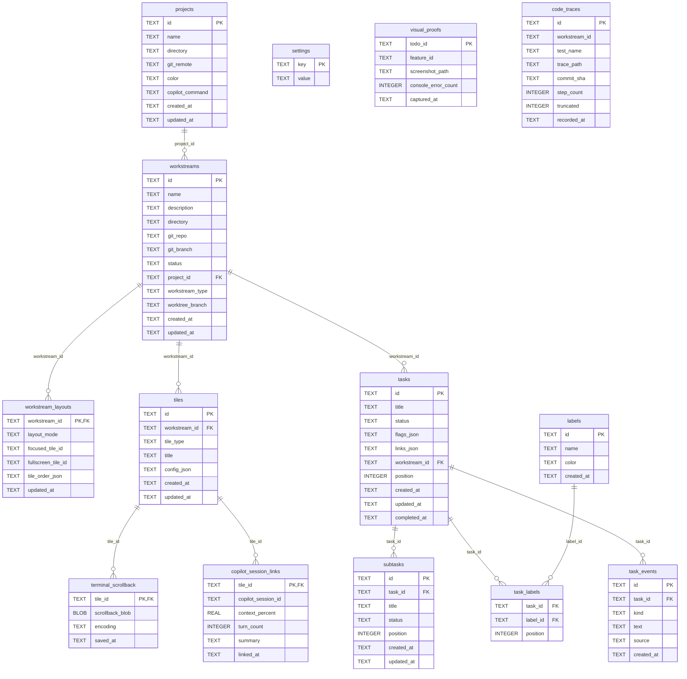

<!--
  AUTO-GENERATED — do not edit by hand.
  Source of truth: src-tauri/src/db.rs
  Regenerate: node scripts/gen-db-model.mjs
-->

# Database model

The Workstreams SQLite schema, generated from `src-tauri/src/db.rs`
(`CREATE TABLE` blocks + `ALTER TABLE … ADD COLUMN` migrations).
**14 tables, 88 columns.**

> This file is regenerated by `scripts/gen-db-model.mjs` and kept in sync by the
> pre-commit hook. Edit the schema in `db.rs`, not here.

## ER diagram

## Column reference

### `projects`

| Column | Type | Constraints |
| --- | --- | --- |
| `id` | TEXT | PK |
| `name` | TEXT | NOT NULL |
| `directory` | TEXT | NOT NULL |
| `git_remote` | TEXT | — |
| `color` | TEXT | NOT NULL |
| `copilot_command` | TEXT | — |
| `created_at` | TEXT | NOT NULL |
| `updated_at` | TEXT | NOT NULL |

### `workstreams`

| Column | Type | Constraints |
| --- | --- | --- |
| `id` | TEXT | PK |
| `name` | TEXT | NOT NULL |
| `description` | TEXT | — |
| `directory` | TEXT | — |
| `git_repo` | TEXT | — |
| `git_branch` | TEXT | — |
| `status` | TEXT | NOT NULL |
| `project_id` | TEXT | FK → projects.id |
| `workstream_type` | TEXT | NOT NULL |
| `worktree_branch` | TEXT | — |
| `created_at` | TEXT | NOT NULL |
| `updated_at` | TEXT | NOT NULL |

### `workstream_layouts`

| Column | Type | Constraints |
| --- | --- | --- |
| `workstream_id` | TEXT | PK, FK → workstreams.id |
| `layout_mode` | TEXT | NOT NULL |
| `focused_tile_id` | TEXT | — |
| `fullscreen_tile_id` | TEXT | — |
| `tile_order_json` | TEXT | NOT NULL |
| `updated_at` | TEXT | NOT NULL |

### `tiles`

| Column | Type | Constraints |
| --- | --- | --- |
| `id` | TEXT | PK |
| `workstream_id` | TEXT | NOT NULL, FK → workstreams.id |
| `tile_type` | TEXT | NOT NULL |
| `title` | TEXT | — |
| `config_json` | TEXT | NOT NULL |
| `created_at` | TEXT | NOT NULL |
| `updated_at` | TEXT | NOT NULL |

### `terminal_scrollback`

| Column | Type | Constraints |
| --- | --- | --- |
| `tile_id` | TEXT | PK, FK → tiles.id |
| `scrollback_blob` | BLOB | — |
| `encoding` | TEXT | NOT NULL |
| `saved_at` | TEXT | NOT NULL |

### `copilot_session_links`

| Column | Type | Constraints |
| --- | --- | --- |
| `tile_id` | TEXT | PK, FK → tiles.id |
| `copilot_session_id` | TEXT | — |
| `context_percent` | REAL | — |
| `turn_count` | INTEGER | — |
| `summary` | TEXT | — |
| `linked_at` | TEXT | NOT NULL |

### `settings`

| Column | Type | Constraints |
| --- | --- | --- |
| `key` | TEXT | PK |
| `value` | TEXT | — |

### `visual_proofs`

| Column | Type | Constraints |
| --- | --- | --- |
| `todo_id` | TEXT | PK |
| `feature_id` | TEXT | NOT NULL |
| `screenshot_path` | TEXT | NOT NULL |
| `console_error_count` | INTEGER | NOT NULL |
| `captured_at` | TEXT | NOT NULL |

### `code_traces`

| Column | Type | Constraints |
| --- | --- | --- |
| `id` | TEXT | PK |
| `workstream_id` | TEXT | — |
| `test_name` | TEXT | NOT NULL |
| `trace_path` | TEXT | NOT NULL |
| `commit_sha` | TEXT | NOT NULL |
| `step_count` | INTEGER | NOT NULL |
| `truncated` | INTEGER | NOT NULL |
| `recorded_at` | TEXT | NOT NULL |

### `labels`

| Column | Type | Constraints |
| --- | --- | --- |
| `id` | TEXT | PK |
| `name` | TEXT | NOT NULL |
| `color` | TEXT | NOT NULL |
| `created_at` | TEXT | NOT NULL |

### `tasks`

| Column | Type | Constraints |
| --- | --- | --- |
| `id` | TEXT | PK |
| `title` | TEXT | NOT NULL |
| `status` | TEXT | NOT NULL |
| `flags_json` | TEXT | NOT NULL |
| `links_json` | TEXT | NOT NULL |
| `workstream_id` | TEXT | FK → workstreams.id |
| `position` | INTEGER | NOT NULL |
| `created_at` | TEXT | NOT NULL |
| `updated_at` | TEXT | NOT NULL |
| `completed_at` | TEXT | — |

### `subtasks`

| Column | Type | Constraints |
| --- | --- | --- |
| `id` | TEXT | PK |
| `task_id` | TEXT | NOT NULL, FK → tasks.id |
| `title` | TEXT | NOT NULL |
| `status` | TEXT | NOT NULL |
| `position` | INTEGER | NOT NULL |
| `created_at` | TEXT | NOT NULL |
| `updated_at` | TEXT | NOT NULL |

### `task_labels`

| Column | Type | Constraints |
| --- | --- | --- |
| `task_id` | TEXT | NOT NULL, FK → tasks.id |
| `label_id` | TEXT | NOT NULL, FK → labels.id |
| `position` | INTEGER | NOT NULL |

### `task_events`

| Column | Type | Constraints |
| --- | --- | --- |
| `id` | TEXT | PK |
| `task_id` | TEXT | NOT NULL, FK → tasks.id |
| `kind` | TEXT | NOT NULL |
| `text` | TEXT | NOT NULL |
| `source` | TEXT | NOT NULL |
| `created_at` | TEXT | NOT NULL |
