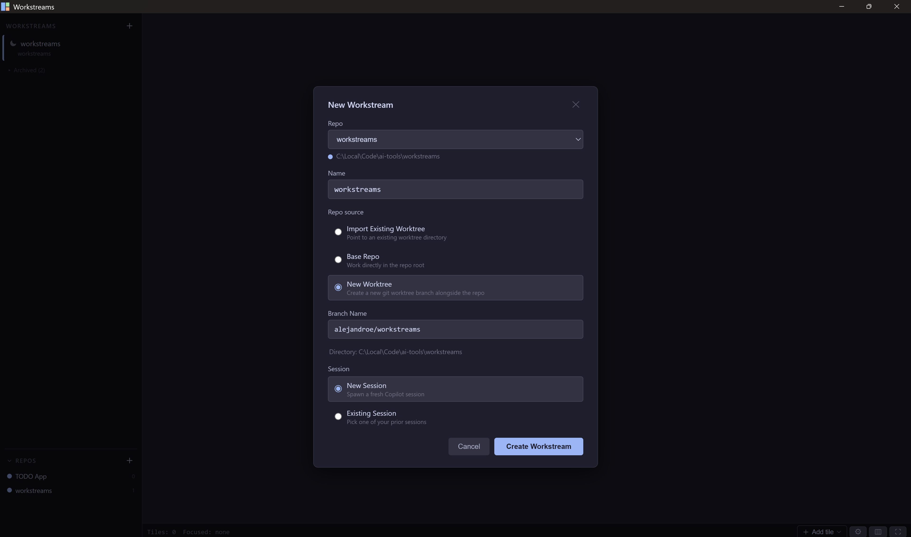
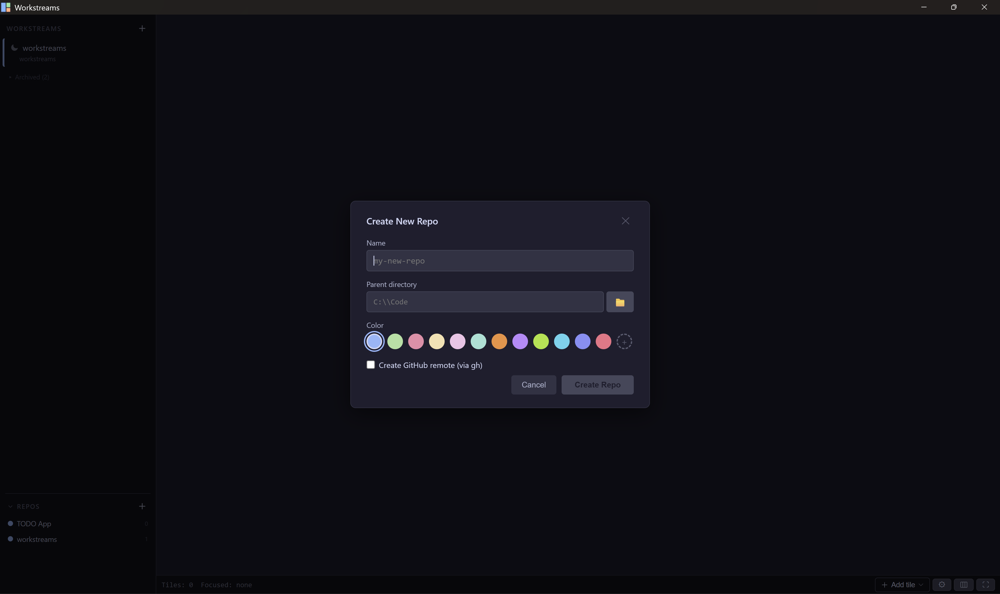
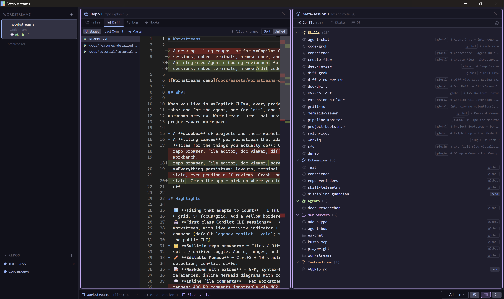
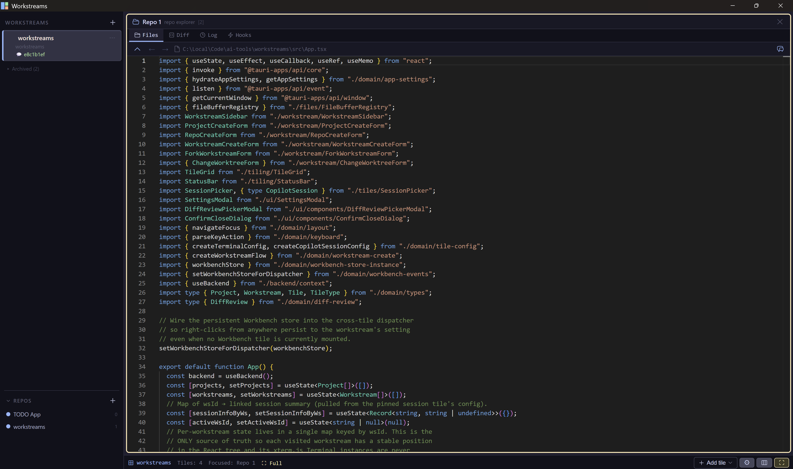
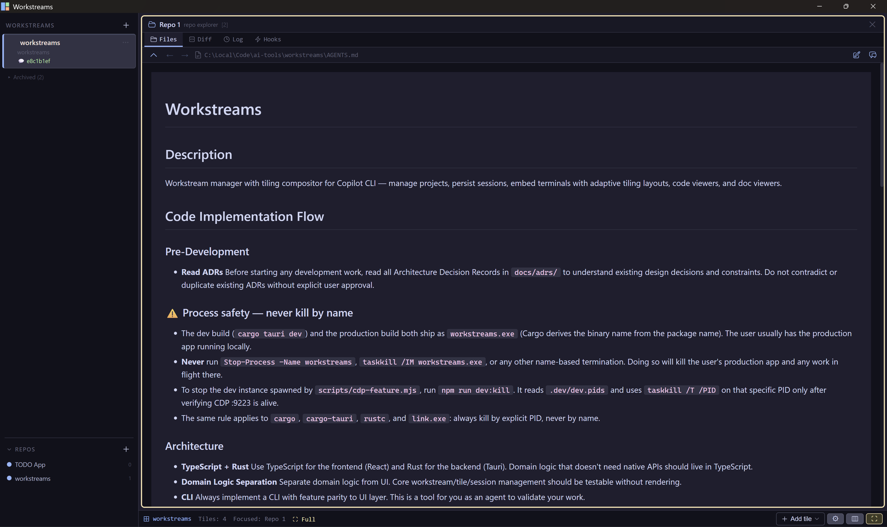

# Features (deep dive)

> A long-form reference for every feature in Workstreams. The [README](../README.md)
> has the elevator pitch; this file is the deep dive.

## Workstream management

Create, switch, and persist project workstreams with git repo detection.
Switching or archiving a workstream prompts before discarding unsaved
editable file buffers.

Each workstream row has a kebab "Change worktree…" action that re-points the
workstream at a different worktree directory (switch existing or create a new
branch worktree) and respawns affected terminal / Copilot session PTYs in the
new location.

The row's activity slot shows one of four states:

- gray hollow square — stopped (workstream hasn't been opened this session)
- nothing — loaded + idle
- pulsating blue dot — any linked Copilot session is working
- bell icon — an agent finished while the workstream was unfocused (clears on focus)

A workstream allows at most one linked Copilot session; secondary Copilot
session tiles hide the "🔗 Link" button so only the first tile becomes the
linked one.



## Repo creation

Add repos via two flows, both surfaced via a dropdown menu under the sidebar `+`:

- **Import existing repo** — pick an existing directory, auto-detect remote
  and branch.
- **Create new repo** — scaffold a folder with README + .gitignore, run
  `git init -b master`, make initial commit, and optionally create a private
  or public GitHub remote via `gh repo create`.



## Adaptive tiling

Tiles auto-arrange:

- 1 tile → fullscreen
- 2 tiles → 50/50 split
- 3 tiles → focus + stack
- 4 tiles → 2x2 grid
- 5+ tiles → focus + grid

The fullscreen tile has a distinct yellow border to make the mode obvious at
a glance. Each tile shows a Heroicon in its header (per-type default,
override via config) and a double-click on the title renames it inline.


A **side-by-side** mode is available when exactly two tiles are selected
(`Alt+S`) for focused compare workflows:



## Terminal tiles

Full interactive terminals via xterm.js + portable-pty (ConPTY on Windows).
Loaded workstreams keep their terminal instances alive while hidden; switching
back explicitly remeasures, fits, and repaints xterm so WKWebView does not show
a stale frame. Hidden workstreams cannot steal terminal focus.

Terminal and Copilot tiles resize xterm and the underlying PTY as one
operation, so a wrapped command line keeps its first row visible and the cursor
stays over the character it is actually on while you edit.

## Code viewer tiles

Monaco Editor with syntax highlighting for 20+ languages, plus the editable
behaviour described under "Editable text files".



## Doc viewer tiles

VS Code-style markdown renderer with:

- GFM support and syntax-highlighted code blocks
- Inline **Mermaid diagrams** with zoom / pan
- On-disk image rendering — relative `` references are
  resolved against the source file's directory and loaded as blob URLs
- Inter-document link navigation: clicking `[other](other.md)` opens the
  target file in the same surface, `#anchor` links scroll within the rendered
  preview, and `http(s)://` links delegate to the system browser
- Repo Explorer hosts a back / forward history for navigating between
  previewed files



## Repo Explorer tile

Multi-tab repo browser (Files / Diff / Log / Hooks / Search):

- Alphabetical sort with folders first
- Ctrl+P filename search, Monaco find-in-file (Ctrl+F)
- Inline previews for audio and image files (png, jpg, gif, webp, bmp, ico,
  svg, avif)
- SQLite databases (`.db`, `.sqlite`, `.sqlite3`, `.db3`, or any file with
  the `SQLite format 3\0` magic header) open in a read-only table browser
- **Diff** tab: unified file-list + Monaco diff editor with A/M/D/R status
  badges. Unstaged includes both modified tracked files and untracked files.
  A **Split / Unified** toggle in the diff toolbar switches between
  side-by-side and inline layouts (persisted per tile). Its modified side is
  editable and supports the same inline file-comment threads as the Files tab;
  comments remain keyed to the repo-relative working file, so they appear in
  either surface. Deleted files and historical diff modes cannot carry file
  comments because they have no modified-side working-file lines. A custom
  branch picker lists local branches and compares the selected target's merge
  base to `HEAD` (`target...HEAD`); the target is persisted per tile and
  restored with the Diff tab.
  Unstaged edits save with `Cmd+S` on macOS or `Ctrl+S` elsewhere. Comment
  composers show a Saving state and inline write errors; successful writes
  close the composer and stale list responses cannot erase the new thread.
- **Log** tab: ahead / behind counts against `origin/<current-branch>`, with
  an `origin/<branch>` badge + accent border on the matching commit
- **Hooks** tab: lists active git hooks; the selected hook opens in a Monaco
  editor with shell syntax highlighting (auto-detected from the shebang for
  extensionless hooks) and an inline Edit / Save / Cancel flow
- Search overlays are scoped inside the tile with arrow-key + Enter
  navigation
- Right-click actions use a viewport-clamped menu: create files/folders with an
  in-app name field, reveal paths in Finder/File Explorer, and dismiss via an
  outside click or Escape without changing fullscreen mode.

A stand-alone CLI scenario (`node scripts/repo-explorer-cli.mjs <dir>
<query>`) mirrors the same filename search logic without launching the
desktop app. `node scripts/repo-explorer-cli.mjs <dir> --diff-branch <branch>`
lists the same `branch...HEAD` changed-file set as the custom diff picker.


## Editable text files

Repo Explorer / Session Meta / Workbench file-detail panes use a
Monaco-backed editor with:

- Explicit Ctrl+S plus 10 s debounced auto-save
- Conditional writes that detect external modification
- Read-only side-by-side conflict diffs
- Dangerous-path warnings for `.git/`, `node_modules/`, build artifacts, and
  lockfiles

See [ADR 006](adrs/006-editable-text-files.md).

## Inline file comments

Per-workstream comments anchored to line ranges in any file viewable in Repo
Explorer.

Toolbar toggle (chat-bubble icon) shows / hides them as Monaco view zones
below the anchored line. Select lines → click the floating `+ Comment`
button → write markdown → Save. Comments get inline Edit / Delete.

Stored in `file_comments` (workstream-scoped SQLite); persistent across app
restarts. See [ADR 009](adrs/009-inline-file-comments.md).

## Session Meta tile

Inspects the linked Copilot session via three tabs:

- **Config** — Skills, Extensions, Agents, MCP Servers, Instructions, Plugins
  (git hooks were removed and stay in the Repo Explorer Hooks tab)
- **State** — file browser of `~/.copilot/session-state/<id>` that navigates
  into subfolders just like Repo Explorer and opens files in the embedded
  Monaco / image / audio viewer
- **DB** — read-only SQLite table browser scoped to the session DB

## Workbench tile

A per-workstream scratch list of files you're actively working on. Right-click
on file rows or the open-file toolbar gets the shared file context menu (copy
path / copy filename / open in system). The opened file's full path is shown
in the viewer toolbar.

## App settings

Status-bar gear opens a Settings modal:

- Three global font sizes: code editor, markdown body, terminal cell
- Terminal scroll speed
- Configurable Copilot CLI command (default `agency copilot --yolo`; set to
  `copilot --yolo` to use the public GitHub Copilot CLI)
- Confirm-close dialog (with a "Don't ask again" checkbox)
- **Disable GPU (WebGL) rendering** — on by default, so terminals use the
  reliable DOM renderer. Uncheck it for extra speed. If a GPU-rendered terminal
  ever goes **black** and won't recover, re-enable the setting to fall back to
  the DOM renderer, which never blanks. Terminals also self-recover from GPU
  context loss and permanently drop to the DOM renderer after repeated losses.

Persisted in the SQLite settings table.

## Session persistence

Workstreams, tile layouts, terminal scrollback, and per-tile view state all
survive app restarts.

## Copilot CLI enrichment

Reads the session-store DB for context %, turn count, summaries. Surfaces
session state per linked tile.

## Copilot sessions

Each workstream has at most one *linked* Copilot CLI session. The linked
session is what the Repo Explorer, Code Review, Goal Loop and inline-comment
surfaces read from and write to, which is why secondary Copilot tiles hide the
"🔗 Link" button.

The tile shows a live activity indicator while the agent is working and rings a
bell when it goes idle while unfocused. The CLI command is configurable — the
default is `agency copilot --yolo`; set it to `copilot --yolo` to use the public
GitHub Copilot CLI.

The command is global by default, but each **repo** can override it: open
**Repos** from the sidebar footer, pick a repo, and set a **Copilot command**
(blank inherits the global). Every workstream in that repo then spawns sessions
with the repo's command — useful when one repo needs a different launcher from
the rest.

## Goal loops

A goal loop runs a bounded orchestrator → worker pipeline against the repo
until the goal is met, and it must prove progress: every definition has to
include deterministic verification, an independent evaluator, human approval,
or a layered combination of those.

Definitions are strict `files/loops/*.loop.yaml` files stored in the
workstream's bound Copilot session (the `create-loop` skill can generate one).
Read and edit them in the Goal Loop tile's **Definitions** tab and execute them
from **Run**. `Alt+L` (`Option+L` on macOS) opens the tile.

Execution model:

- `limits.taskAttempts` configures the **total** worker attempt budget,
  including the initial attempt.
- Accepted batches feed back into orchestration, and the run continues until a
  cycle reports that the overall goal has no work remaining.
- Verifiers may be repository scripts outside the definition folder.
- Every run pins the exact YAML and its SHA-256 hash, so the evidence stays
  durable even if the definition later changes.

Human-gated runs persist an **Awaiting approval** stage with Approve / Request
revision / Reject actions in the tile, plus an approval indicator in the
sidebar.

**Pause survives a restart.** Pause a run, quit the app, reopen, and Resume.
Queued tasks are preserved and the wall-clock budget is refreshed, because time
spent paused is not compute time.

The run view is overview-first. State, elapsed time, next expected evidence and
a **measured time breakdown** (per-role totals plus the single slowest stage)
sit at the top, while the definition, objective, task list and event timeline
stay collapsed. Every agent and verifier episode records its own duration, so
"which step is slow" is answered from evidence rather than guesswork. Tasks are
listed **newest-first** with a sort toggle and a state filter, long results
collapse to a preview, and the list auto-opens only when something needs
attention. Each card foregrounds only the current state or the latest
actionable evaluator request, keeping worker JSON, evidence and historical
evaluations behind **Details**.

The same controller is scriptable, so definitions can be authored and verified
without opening the app:

```bash
npm run loop:cli -- validate <repo> <file>   # check against the authoritative parser
npm run loop:cli -- list <repo>              # discover definitions
npm run loop:cli -- run-file <repo> <file>   # execute one
```

MVP1 is manual and local: a loop runs while Workstreams is open. See
[ADR 021](adrs/021-manual-coding-goal-loop.md),
[ADR 022](adrs/022-versioned-loop-definitions.md), and
[ADR 023](adrs/023-human-loop-approval.md).

## Task board and devlog export

The task board is a **global** surface (sidebar → **Tasks**), not a tile,
because a task may have no workstream and often outlives the one it had.

Five columns match the active status vocabulary used in a hand-written devlog
(⚒️ 👁️ 🧊 🚗 🙋 ✅), with:

- **Label swimlanes**, so a long in-progress column stays scannable.
- **Per-column tinting with lane separators.** In progress is the most salient
  column and labels itself `In progress (active)`, so the cue never rests on
  colour alone.
- **Drag-and-drop** between columns. Dropping a card back on its own column is
  a no-op, so `🕵️` and `❌` keep their glyph.

Each card shows its **open subtasks with individual state** plus a done/total
count (completed subtasks drop off the card and stay visible in the detail
panel) and links straight to the **workstream** it is attached to.

Per task there is an **append-only activity log** and one **free-form Notes**
field — editable multi-line context that lands in the exported page. Notes can
be deleted but never rewritten. **URLs in log entries are clickable**, and links
found in the notes are surfaced as a clickable row under the box; both open in
the system browser.

Input commits differ by field on purpose: the single-line **label and subtask
boxes commit with `Enter`**, while the log entry box keeps `⌘⏎` so a multi-line
entry is still possible.

A workstream's `⋯` menu has **Create task…**, which opens the board with a task
already created, named after the workstream, attached to it, and selected for
renaming — and **Go to task** once it is bound, since the relation is 1:1.
Creating a task always opens **that** task's detail pane, even if another was
already selected. The sidebar keeps an always-on list of **in-progress tasks**
that navigates straight to the bound workstream, or, when you are already in
it, opens the task on the board.

**Export** renders the **last work day or today** (your pick, skipping
weekends) into your wiki as markdown — one `##` section per task with its
labels, workstream, subtasks, notes and event log — then commits and pushes it.
Export is one-way and never overwrites a page it did not generate. **Preview**
shows exactly what would be written without writing anything.

See [ADR 020](adrs/020-task-board-devlog-export.md).

## Local code review

A diff-first, PR-style review tile for AI-agent *or* human-written code, with
no Azure DevOps round-trips and no MCP. `Alt+A` opens it.

Pick a diff source (working tree, last commit, or a branch base), read the real
diff, comment inline on the modified side, and **edit code in place** in the
diff when the source is the working tree.

Comments live in the bound Copilot session's own `session.db`. The agent reads
and replies with its built-in `sql` tool (guided by the `code-review` skill),
and you pull in the replies with the **Sync** button.

See [ADR 014](adrs/014-code-review-tile.md).

## Search all files

The Search tab (or `Ctrl+Shift+F`) runs a fast content search across the repo,
respecting `.gitignore` and grouping matches by file with highlighted previews.
Click a result to jump straight to that line.

Toggle case-sensitive (`Aa`) or regex (`.*`) matching. `Ctrl+P` still does
filename search. Searches run off the UI thread, so they never freeze the app.

See [ADR 012](adrs/012-repo-content-search.md).

## Editable unstaged diffs and review threads

The **Unstaged** diff is **editable in place**: type on the modified side and
`Cmd+S` / `Ctrl+S` (or the Save button) writes straight to the working file,
then re-reads the diff.

Inline file comments work there too — select modified-side lines and use the
comment toggle to create the same reviewer↔agent threads shown in the Files
tab. A second toggle **hides resolved threads**, so a heavily-reviewed file
shows only what is still open. Comments can be deleted straight from the
Comments tab list (one thread, or every thread the filters leave visible) or,
when their file no longer exists, from the load-failure view.

Historical modes (Last commit, Branch vs master, or a **custom target branch**)
stay read-only and uncommentable, because their modified side is a past commit
rather than a file on disk.

Threads imported from an external review (for example via the
`ado-file-comments` skill) keep the **original reviewer's name** rather than
being attributed to you, and are read-only.

## Code walkthrough (experimental)

Step through a Rust test's **real execution** to understand code, not to debug
it. Because it is a replay, you can also step **backwards**.

Record once, then replay in the app:

```bash
node scripts/trace-record.mjs --test <name> [--package <crate>]
```

The walkthrough tile drives a bound Repo Explorer, so you get debug order *and*
the freedom to wander off and hit **Resync**. Traces are stored under the owning
Copilot session, not in your repo, so they never show up in `git status`.

Replay works on any platform. **Recording** needs a debug adapter:

- macOS / Linux — `lldb-dap` (Xcode Command Line Tools or an LLVM install).
- Windows — [CodeLLDB](https://marketplace.visualstudio.com/items?itemName=vadimcn.vscode-lldb)
  (`code --install-extension vadimcn.vscode-lldb`), because it bundles the PDB
  reader an MSVC-toolchain Rust build needs.

Point `WORKSTREAMS_DAP_ADAPTER` at an adapter in a non-standard location.
Recording *from the tile* is macOS-only for now; on Windows use the CLI.

Test discovery is explicit rather than automatic: enter an optional Cargo
package (`-p`) and name filter, then press **Load**. It runs in the background
and does not open a terminal window.

`Alt+D` opens the tile (disabled by default — see App settings and feature
flags). With it focused, `↑`/`↓` step, `o` finishes the current function and
returns to its caller, `Home`/`End` jump to the ends, and `r` resyncs the
editor.

Equivalent CLIs:

```bash
node scripts/trace-tests.mjs --manifest-dir <dir> [--package <name>] [--filter <text>]
node scripts/trace-replay.mjs <trace.json>
```

See [ADR 018](adrs/018-code-walkthrough-debugger.md).

## Workstream lifecycle

**Switch a workstream to another repo** with the same **Change worktree…**
action. Pick a directory in a different repo and the workstream moves repo with
it — colour, grouping and tile working directories follow. A directory in no
known repo is refused up front rather than importing itself.

**Close (stop) a workstream** from the row's `⋯` menu → **Close (stop
processes)**. This tears down a loaded workstream's tiles and terminals
(killing its PTYs) without archiving it. It stays in the active list and
reverts to the moon "stopped" indicator, exactly like a workstream that has not
been opened yet this session; selecting it again reloads and respawns
everything.

The sidebar groups workstreams by what they are doing — **Live** (tiles and
processes running) and **Idle** (kept, but stopped) — with archived work and
repo administration tucked out of the way. "Idle" is a runtime fact rather than
a stored status, which is why closed workstreams used to be indistinguishable
from running ones. See [ADR 019](adrs/019-sidebar-status-sections.md).

## Non-blocking worktree operations

Creating or archiving a workstream runs its git work (pull, worktree
add/remove) on a background thread, so the UI never freezes. The sidebar row
itself shows live provisioning / archiving progress, and failures surface
inline with Retry / Discard.

See [ADR 011](adrs/011-nonblocking-worktree-ops.md).

## Present mode (markdown slides)

Any markdown file opened in Repo Explorer, Workbench, or Session Meta can be
presented as a slide deck.

- Use the three-way **mode selector** (Edit / Preview / Slides) in the file
  toolbar to jump straight to any mode in one click; the Slides segment shows
  for markdown only. `Ctrl+Shift+V` still flips preview ⇄ edit.
- Slides are split on `---` thematic breaks. A leading YAML frontmatter block
  is treated as deck config (for example `fontScale: 1.5`), not a slide.
- Navigate with `→` / `Space` / `PageDown` (next), `←` / `PageUp` (prev),
  `Home` / `End`, or click the right / left half of the slide. An auto-dimming
  control cluster shows the slide counter and a progress bar.
- `Alt+F` (or double-click the tile header) goes fullscreen; `Esc` exits
  present mode back to preview.

Slides render the live editor buffer, so editing a slide and flipping back to
Present reflects changes immediately.

## Keyboard and mouse reference

All app-level commands use **Alt** to avoid conflicts with terminal
(`Ctrl+C/V/...`) and Monaco (`Ctrl+F/P/...`) shortcuts.

| Key | Action |
|-----|--------|
| `Alt+C` | New Copilot session tile |
| `Alt+T` | New terminal tile (PowerShell) |
| `Alt+W` | New terminal tile (WSL) |
| `Alt+R` | New Repo Explorer tile |
| `Alt+M` | New Session Meta tile |
| `Alt+B` | New Workbench tile |
| `Alt+A` | New Code Review tile |
| `Alt+L` | New Goal Loop tile |
| `Alt+D` | New Code Walkthrough tile (disabled by default) |
| `Alt+Q` | Close focused tile |
| `Alt+F` | Toggle fullscreen for focused tile |
| `Alt+S` | Toggle side-by-side (when exactly 2 tiles are selected) |
| `Alt+Arrows` | Navigate between tiles |
| `Ctrl+S` | Save focused file editor |
| `Ctrl+P` | Filename search (Repo Explorer) |
| `Ctrl+Shift+F` | Content search — "search all files" (Repo Explorer) |
| `Ctrl+Shift+V` | Toggle markdown preview / edit (VS Code parity) |
| `Esc` | Unfocus terminal / close modal |

Mouse:

- **Double-click a tile's header bar** to toggle fullscreen for that tile.
- **Shift-click another tile** while one is focused to compare the two
  side-by-side; the focused tile becomes the left pane.

## macOS environment

Apps launched from the Dock, Finder, or Spotlight inherit launchd's minimal
`PATH` (`/usr/bin:/bin:/usr/sbin:/sbin`) and never read `~/.zshrc`, which would
hide `copilot`, `agency`, `node` and Homebrew binaries from every tile.

On a GUI launch Workstreams detects this and asks your login shell for its
`PATH` once, then uses it for spawned tiles, loop verifiers and trace
recording — so no `PATH` setup is needed, and a verifier calling `npm` or
`cargo` resolves the same way it does in a terminal.

Because that value is snapshotted at startup, **restart the app after editing
your shell profile**.

Terminal tiles run your login shell (`$SHELL`, falling back to `/bin/zsh`)
instead of PowerShell, and the WSL tile is hidden. The Copilot CLI must be
installed and on your `PATH`.

See [ADR 016](adrs/016-macos-support.md) and
[ADR 017](adrs/017-macos-gui-launch-path.md).
