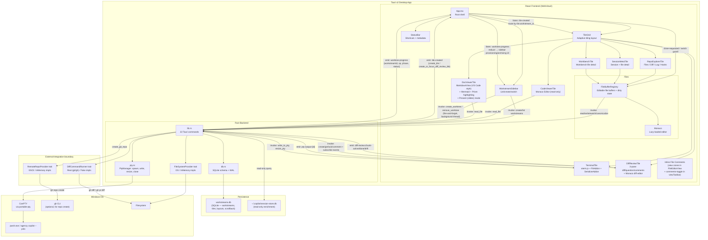

# System Architecture — Agent Manager

```mermaid
graph TB
    subgraph Tauri["Tauri v2 Desktop App"]
        subgraph Frontend["React Frontend (WebView2)"]
            App["App.tsx<br/>Root shell"]
            Sidebar["WorkstreamSidebar<br/>List/create/switch"]
            TileGrid["TileGrid<br/>Adaptive tiling layout"]
            Terminal["TerminalTile<br/>xterm.js + FitAddon + SerializeAddon"]
            CodeView["CodeViewerTile<br/>Monaco Editor (read-only)"]
            DocView["DocViewerTile<br/>MarkdownView (VS Code style)<br/>+ Mermaid + Prism highlighting<br/>+ Present (slides) mode"]
            RepoExplorer["RepoExplorerTile<br/>Files / Diff / Log / Hooks"]
            SessionMeta["SessionMetaTile<br/>Session + file detail"]
            Workbench["WorkbenchTile<br/>Workbench file detail"]
            DiffReview["DiffReviewTile<br/>3-pane diff/question/comments<br/>+ Monaco diff editor"]
            InlineComments["Inline File Comments<br/>(view zones in FileEditorView<br/>+ comments-toggle in viewToolbar)"]
            StatusBar["StatusBar<br/>Shortcuts + metadata"]
            subgraph Files["Files"]
                FileBuffers["FileBufferRegistry<br/>Editable file buffers + dirty state"]
                Monaco["Monaco<br/>Lazy-loaded editor"]
            end
        end

        subgraph Backend["Rust Backend"]
            LibRS["lib.rs<br/>22 Tauri commands"]
            PtyRS["pty.rs<br/>PtyManager: spawn, write, resize, close"]
            DbRS["db.rs<br/>SQLite schema + WAL"]
            FileSystemProvider["FileSystemProvider trait<br/>OS / InMemory impls"]
        end
    end

    subgraph Storage["Persistence"]
        AppDB["workstreams.db<br/>(SQLite — workstreams, tiles, layouts, scrollback)"]
        CopilotDB["~/.copilot/session-store.db<br/>(read-only enrichment)"]
    end

    subgraph OS["Windows OS"]
        ConPTY["ConPTY<br/>via portable-pty"]
        Shell["pwsh.exe / agency copilot --yolo"]
        GhCli["gh CLI<br/>(optional, for repo create)"]
        FileSystem["Filesystem"]
    end

    subgraph Providers["External-integration boundary"]
        RemoteProv["RemoteRepoProvider trait<br/>GhCli / InMemory impls"]
        DiffRunner["DiffCommandRunner trait<br/>Real (git/gh) / Fake impls"]
    end

    App --> Sidebar
    App --> TileGrid
    TileGrid --> Terminal
    TileGrid --> CodeView
    TileGrid --> DocView
    TileGrid --> RepoExplorer
    TileGrid --> SessionMeta
    TileGrid --> Workbench
    TileGrid --> DiffReview
    App --> StatusBar
    App -- "close-requested / switch guard" --> FileBuffers

    Terminal -- "invoke: write_to_pty, resize_pty" --> LibRS
    LibRS -- "emit: pty-output-{id}" --> Terminal
    Sidebar -- "invoke: create/list workstreams" --> LibRS
    CodeView -- "invoke: read_file" --> LibRS
    DocView -- "invoke: read_file" --> LibRS
    RepoExplorer --> FileBuffers
    SessionMeta --> FileBuffers
    Workbench --> FileBuffers
    FileBuffers --> Monaco
    FileBuffers -- "invoke: read/write/watch/canonicalize" --> LibRS

    LibRS --> PtyRS
    LibRS --> DbRS
    PtyRS --> ConPTY
    ConPTY --> Shell
    DbRS --> AppDB
    LibRS -- "read-only query" --> CopilotDB
    LibRS --> FileSystemProvider
    FileSystemProvider --> FileSystem
    LibRS -- "create_git_repo" --> RemoteProv
    RemoteProv -- "gh repo create" --> GhCli
    DiffReview -- "invoke: create/get/ack/comment + subscribe events" --> LibRS
    LibRS -- "emit: diff-review:chunk-active/done/drift" --> DiffReview
    LibRS -- "emit: tile-created<br/>(create_tile / create_or_focus_diff_review_tile)" --> App
    App -- "listen: tile-created<br/>route by tile.workstream_id" --> TileGrid
    Sidebar -- "invoke: create_worktree / remove_worktree<br/>(fire-and-forget, background thread)" --> LibRS
    LibRS -- "emit: worktree-progress<br/>{workstreamId, op, phase, status}" --> App
    App -- "listen: worktree-progress<br/>reduce → sidebar provisioning/archiving UI" --> Sidebar
    LibRS --> DiffRunner
    DiffRunner -- "git diff / gh pr diff" --> FileSystem
```
