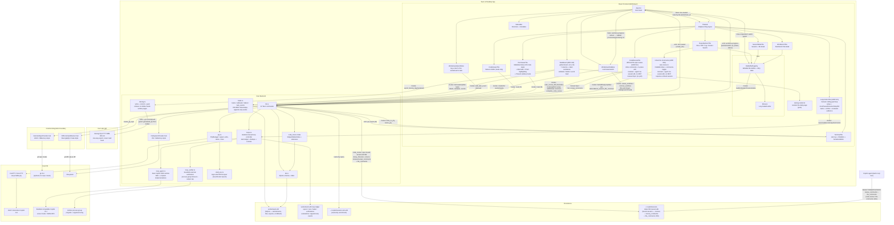

# System Architecture — Agent Manager

```mermaid
graph TB
    subgraph Tauri["Tauri v2 Desktop App"]
        subgraph Frontend["React Frontend (WebView2)"]
            App["App.tsx<br/>Root shell"]
            Sidebar["WorkstreamSidebar<br/>List/create/switch"]
            TileGrid["TileGrid<br/>Adaptive tiling layout"]
            Terminal["TerminalTile<br/>xterm.js + FitAddon + SerializeAddon"]
            CodeView["CodeViewerTile<br/>Monaco Editor (read-only)"]
            DocView["DocViewerTile<br/>MarkdownView (VS Code style)<br/>+ Mermaid + Prism highlighting<br/>+ Present (slides) mode"]
            RepoExplorer["RepoExplorerTile<br/>Files / Diff / Log / Hooks / Search"]
            SessionMeta["SessionMetaTile<br/>Session + file detail"]
            Workbench["WorkbenchTile<br/>Workbench file detail"]
            CodeReview["CodeReviewTile<br/>diff-first PR-style review (ADR 014)<br/>inline comments + in-place edit<br/>reviewer↔agent via session.db, no MCP<br/>manual Sync (no poll)"]
            LoopControl["LoopControlTile (ADR 021)<br/>manual coding goal loop<br/>setup + Run/Pause/Resume/Stop/Kill<br/>tasks + verifier + evaluator evidence"]
            InlineComments["Inline File Comments (ADR 009)<br/>view zones in FileEditorView + comments-toggle<br/>reviewer↔agent via session.db, no MCP<br/>requires a linked session"]
            TaskBoard["TaskBoard (ADR 020)<br/>global board, not a tile<br/>7 columns + label swimlanes<br/>subtasks / labels / event feed"]
            QuickNote["WorkstreamQuickNote<br/>log a note to this workstream's task"]
            DevlogRender["devlog-render.ts<br/>renders the daily page (pure)"]
            StatusBar["StatusBar<br/>Shortcuts + metadata"]
            subgraph Files["Files"]
                FileBuffers["FileBufferRegistry<br/>Editable file buffers + dirty state"]
                Monaco["Monaco<br/>Lazy-loaded editor"]
            end
        end

        subgraph Backend["Rust Backend"]
            LibRS["lib.rs<br/>22 Tauri commands"]
            PtyRS["pty.rs<br/>PtyManager: spawn, write, resize, close"]
            LoopRS["loops.rs<br/>durable manual-loop controller<br/>task ledger + dedupe + controls"]
            LoopAgentRS["loop_agent.rs<br/>Rust Copilot SDK runtime<br/>SDK + scripted implementations"]
            LoopVerifierRS["loop_verifier.rs<br/>bounded external verification<br/>process-group timeout + output cap"]
            ShellEnvRS["shell_env.rs<br/>login-shell PATH repair (macOS GUI launch)"]
            CodeTraceRS["code_traces index<br/>list/get/delete/index + staleness"]
            TasksRS["tasks.rs<br/>tasks / subtasks / labels / task_events<br/>ISO-8601 timestamps, append-only events"]
            DevlogRS["devlog.rs<br/>write + commit + push<br/>refuses to clobber hand-written pages"]
            DbRS["db.rs<br/>SQLite schema + WAL"]
            FileSystemProvider["FileSystemProvider trait<br/>OS / InMemory impls"]
        end
    end

    subgraph Storage["Persistence"]
        AppDB["workstreams.db<br/>(SQLite — workstreams, tiles, layouts, scrollback)"]
        LoopDB["workstreams.db loop ledger<br/>specs / runs / tasks / verifications<br/>evaluations / append-only events"]
        CopilotDB["~/.copilot/session-store.db<br/>(read-only enrichment)"]
        CopilotSessionDB["~/.copilot/session-state/&lt;id&gt;/session.db<br/>(bound session — reviews + review_comments<br/>+ file_comments, RW)"]
    end

    subgraph Wiki["User wiki (git)"]
        DevlogDir["devlog/&lt;fy&gt;/YYYY-MM-DD.md<br/>one-way export, never read back"]
    end

    subgraph OS["Host OS"]
        ConPTY["ConPTY / Unix PTY<br/>via portable-pty"]
        Shell["shell / interactive Copilot CLI"]
        CopilotServer["Bundled compatible Copilot CLI<br/>server mode / JSON-RPC"]
        VerifierProcess["Verifier process group<br/>program + argument array"]
        GhCli["gh CLI<br/>(optional, for repo create)"]
        FileSystem["Filesystem"]
    end

    subgraph Providers["External-integration boundary"]
        RemoteProv["RemoteRepoProvider trait<br/>GhCli / InMemory impls"]
        DiffRunner["DiffCommandRunner trait<br/>Real (git/gh) / Fake impls"]
    end

    App --> Sidebar
    App --> TileGrid
    TileGrid --> Terminal
    TileGrid --> CodeView
    TileGrid --> DocView
    TileGrid --> RepoExplorer
    TileGrid --> SessionMeta
    TileGrid --> Workbench
    TileGrid --> CodeReview
    TileGrid --> LoopControl
    App --> StatusBar
    App -- "close-requested / switch guard" --> FileBuffers

    Terminal -- "invoke: write_to_pty, resize_pty" --> LibRS
    LibRS -- "emit: pty-output-{id}" --> Terminal
    Sidebar -- "invoke: create/list workstreams" --> LibRS
    App --> TaskBoard
    App --> QuickNote
    TaskBoard --> DevlogRender
    TaskBoard -- "invoke: list/create/update tasks<br/>labels, subtasks, events" --> TasksRS
    QuickNote -- "invoke: add_task_event (manual)" --> TasksRS
    TaskBoard -- "invoke: export_devlog_day(rendered)" --> DevlogRS
    TasksRS --> AppDB
    DevlogRS -- "write + git commit/push<br/>guard: generated_by front matter" --> DevlogDir
    CodeView -- "invoke: read_file" --> LibRS
    DocView -- "invoke: read_file" --> LibRS
    RepoExplorer --> FileBuffers
    RepoExplorer --> InlineComments
    SessionMeta --> FileBuffers
    Workbench --> FileBuffers
    FileBuffers --> Monaco
    FileBuffers -- "invoke: read/write/watch/canonicalize" --> LibRS

    LibRS --> PtyRS
    LibRS --> LoopRS
    LoopControl -- "invoke: save/enable/run/snapshot/control" --> LoopRS
    LoopRS --> LoopAgentRS
    LoopAgentRS --> CopilotServer
    LoopRS --> LoopVerifierRS
    LoopVerifierRS --> VerifierProcess
    LoopRS --> LoopDB
    PtyRS --> ShellEnvRS
    LibRS --> DbRS
    LibRS --> CodeTraceRS
    CodeTraceRS --> DbRS
    PtyRS --> ConPTY
    ConPTY --> Shell
    DbRS --> AppDB
    LibRS -- "read-only query" --> CopilotDB
    LibRS --> FileSystemProvider
    FileSystemProvider --> FileSystem
    LibRS -- "create_git_repo" --> RemoteProv
    RemoteProv -- "gh repo create" --> GhCli
    CodeReview -- "invoke: code_review_diff_files/sides,<br/>create/get/list review, add/list/set comment,<br/>complete_code_review" --> LibRS
    LibRS -- "code_review: open bound session.db RW<br/>(busy_timeout) + ensure reviews/review_comments<br/>+ file_comments" --> CopilotSessionDB
    CodeReview -- "manual Sync: list_review_comments" --> LibRS
    InlineComments -- "invoke: list/add/reply/update/<br/>set-status/delete_session_file_comment" --> LibRS
    Agent["Copilot agent (built-in sql tool)"] -- "SELECT/INSERT/UPDATE review_comments + file_comments<br/>(code-review / file-comments skills)" --> CopilotSessionDB
    LibRS -- "emit: tile-created (create_tile)" --> App
    App -- "listen: tile-created<br/>route by tile.workstream_id" --> TileGrid
    Sidebar -- "invoke: create_worktree / remove_worktree<br/>(fire-and-forget, background thread)" --> LibRS
    LibRS -- "emit: worktree-progress<br/>{workstreamId, op, phase, status}" --> App
    App -- "listen: worktree-progress<br/>reduce → sidebar provisioning/archiving UI" --> Sidebar
    LibRS --> DiffRunner
    DiffRunner -- "git diff / gh pr diff" --> FileSystem
```
