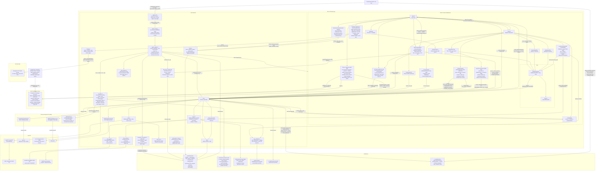

# System Architecture — Workstreams

```mermaid
graph TB
    subgraph Tauri["Tauri v2 Desktop App"]
        subgraph Frontend["React Frontend (WebView2)"]
            App["App.tsx<br/>Root shell"]
            Sidebar["WorkstreamSidebar<br/>List/create/switch<br/>loaded set restored at startup (ADR 029)<br/>tiles mount lazily on first visit"]
            PrInboxUI["PR inbox (ADR 030, 031)<br/>per-repo watch mode + unread badge<br/>events grouped per PR<br/>read/unread + open ADO<br/>local snapshot refresh every 5s"]
            TileGrid["TileGrid<br/>Adaptive tiling layout"]
            Terminal["TerminalTile<br/>xterm.js + FitAddon + SerializeAddon"]
            CodeView["CodeViewerTile<br/>Monaco Editor (read-only)"]
            DocView["DocViewerTile<br/>MarkdownView (VS Code style)<br/>+ Mermaid + Prism highlighting<br/>+ Present (slides) mode"]
            RepoExplorer["RepoExplorerTile<br/>Files / Diff / Log / Hooks / Search"]
            SessionMeta["SessionMetaTile<br/>Session + file detail"]
            Workbench["WorkbenchTile<br/>Workbench file detail"]
            CodeReview["CodeReviewTile<br/>diff-first PR-style review (ADR 014)<br/>inline comments + in-place edit<br/>reviewer↔agent via session.db, no MCP<br/>manual Sync (no poll)"]
            LoopControl["LoopControlTile (ADR 021/022/023)<br/>Definitions: shared YAML editor<br/>Run: catalog + controls/evidence<br/>human Approve/Revise/Reject"]
            InlineComments["Inline File Comments (ADR 009)<br/>view zones in FileEditorView + comments-toggle<br/>reviewer↔agent via session.db, no MCP<br/>requires a linked session"]
            TaskBoard["TaskBoard (ADR 020, sunset by ADR 028)<br/>hidden behind the tasks flag; code + data kept<br/>global board, not a tile<br/>7 columns + label swimlanes<br/>subtasks / labels / event feed"]
            QuickNote["WorkstreamQuickNote (still shipped)<br/>log a note to this workstream's task<br/>the part that survived; seeds the future per-workstream log"]
            DevlogRender["devlog-render.ts<br/>renders the daily page (pure)"]
            StatusBar["StatusBar<br/>Shortcuts + metadata"]
            Companion["Phone companion (ADR 033)<br/>src/companion: publisher + executor + runtime<br/>HMAC-checked requests, run at most once<br/>publishes phone sessions + their messages<br/>off by default; never in dev builds"]
            subgraph Files["Files"]
                FileBuffers["FileBufferRegistry<br/>Editable file buffers + dirty state"]
                Monaco["Monaco<br/>Lazy-loaded editor"]
            end
        end

        subgraph Backend["Rust Backend"]
            LibRS["lib.rs<br/>22 Tauri commands"]
            PtyRS["pty.rs<br/>PtyManager: spawn, write, resize, close"]
            LoopRS["loops.rs<br/>durable goal-loop controller<br/>repeated orchestration + task ledger<br/>dedupe + controls"]
            LoopAgentRS["loop_agent.rs<br/>Rust Copilot SDK runtime<br/>SDK + scripted implementations"]
            LoopVerifierRS["loop_verifier.rs<br/>bounded external verification<br/>process-group timeout + output cap"]
            LoopDefinitionRS["loop_definition.rs<br/>strict YAML parser + catalog<br/>path resolution + SHA-256 snapshot"]
            ShellEnvRS["shell_env.rs<br/>login-shell PATH repair (macOS GUI launch)"]
            CodeTraceRS["code_traces index<br/>list/get/delete/index + staleness"]
            TasksRS["tasks.rs<br/>tasks / subtasks / labels / task_events<br/>ISO-8601 timestamps, append-only events"]
            DevlogRS["devlog.rs<br/>write + commit + push<br/>refuses to clobber hand-written pages"]
            AgentSocketRS["agent_socket.rs<br/>Unix socket in $TMPDIR, 0600<br/>newline-JSON frames<br/>connect-then-unlink stale reclaim"]
            AgentRegistryRS["agent_registry.rs<br/>named commands + app-issued tokens<br/>scope via created_by_session<br/>command_log (actor = what app can prove)"]
            CompanionMsgRS["companion_messages.rs (ADR 033)<br/>phone sessions + agent messages<br/>50 per session, pruned after 3 days"]
            DiffOrderRS["diff_order.rs (ADR 032)<br/>exact-file-set check<br/>file-set + content fingerprints<br/>freshness: current / content / files"]
            WorkLanesRS["work_lanes + lane_id<br/>named folders for related workstreams<br/>unique names, ON DELETE SET NULL"]
            PullRequestsRS["pull_requests.rs<br/>ADO PR URL parsing<br/>canonical identity for dedup<br/>link storage only, no network"]
            PrInboxRS["pr_inbox.rs<br/>one app-lifetime polling worker, 120s<br/>az token + strict ADO HTTP targets<br/>reviewer/author search + deep poll (cap 25)<br/>diff engine: comments, votes, gates, closure"]
            AgentCliRS["agent_cli.rs<br/>workstreams agent ...<br/>JSON stdout / human stderr / exit codes"]
            DbRS["db.rs<br/>SQLite schema + WAL"]
            FileSystemProvider["FileSystemProvider trait<br/>OS / InMemory impls"]
        end
    end

    subgraph Storage["Persistence"]
        AppDB["workstreams.db<br/>(SQLite — workstreams, tiles, layouts, scrollback<br/>+ command_log audit/telemetry<br/>+ workstream_pull_requests N:M links<br/>+ work_lanes<br/>+ diff_orders)"]
        PrInboxDB["workstreams.db inbox state<br/>pr_inbox_config / baselines / seen / events<br/>role-scoped baselines + per-PR sub-state<br/>account-scoped dedup + durable read state"]
        LoopDB["workstreams.db loop ledger<br/>specs / runs / tasks / verifications<br/>evaluations / human approvals / events"]
        LoopYAML["bound session-state/files/loops/*.loop.yaml<br/>loop definition authority"]
        CopilotDB["~/.copilot/session-store.db<br/>(read-only enrichment)"]
        CopilotSessionDB["~/.copilot/session-state/&lt;id&gt;/session.db<br/>(bound session — reviews + review_comments<br/>+ file_comments, RW)"]
    end

    subgraph Wiki["User wiki (git)"]
        DevlogDir["devlog/&lt;fy&gt;/YYYY-MM-DD.md<br/>one-way export, never read back"]
    end

    subgraph OS["Host OS"]
        ConPTY["ConPTY / Unix PTY<br/>via portable-pty"]
        Shell["shell / interactive Copilot CLI"]
        CopilotServer["Bundled compatible Copilot CLI<br/>server mode / JSON-RPC"]
        VerifierProcess["Verifier process group<br/>program + argument array"]
        GhCli["gh CLI<br/>(optional, for repo create)"]
        AzureCli["az account get-access-token<br/>30s timeout; token only in memory"]
        FileSystem["Filesystem"]
    end

    subgraph SyncCloud["User's SyncEngine server"]
        CompanionDoc["Companion Automerge document<br/>laptop: workstreams, lanes, lastSeenAt<br/>requests: signed load / create / session<br/>sessions: phone-started sessions + agent messages<br/>+ ephemeral presence every 10s"]
    end

    PhoneApp["workstreams-companion<br/>(Android, Tauri 2 + React)<br/>signs requests with the pairing secret<br/>Messages: reads agent replies"]

    subgraph Providers["External-integration boundary"]
        RemoteProv["RemoteRepoProvider trait<br/>GhCli / InMemory impls"]
        DiffRunner["DiffCommandRunner trait<br/>Real (git/gh) / Fake impls"]
        AdoAPI["ADO REST API<br/>authenticated identity + active PR pages<br/>JsonTransport: HTTPS / in-memory test responses"]
    end

    App --> Sidebar
    App --> Companion
    Companion -- "publish list + presence<br/>write outcomes" --> CompanionDoc
    CompanionDoc -- "requests" --> Companion
    Companion -- "mountWorkstream / create / spawn_copilot_session(-i prompt)" --> LibRS
    PhoneApp -- "Automerge sync over WebSocket" --> CompanionDoc
    App --> PrInboxUI
    Sidebar --> PrInboxUI
    PrInboxUI -- "Tauri: configure / snapshot / read state" --> PrInboxRS
    AgentRegistryRS -- "inbox.configure / list / read" --> PrInboxRS
    AgentRegistryRS -- "diff.order.set / get" --> DiffOrderRS
    AgentRegistryRS -- "companion.send (phone sessions only)" --> CompanionMsgRS
    CompanionMsgRS -- "companion_sessions / companion_messages" --> AppDB
    RepoExplorer -- "get_diff_order (sort + drift markers)" --> DiffOrderRS
    DiffOrderRS -- "diff_orders table" --> AppDB
    PrInboxRS --> AzureCli
    PrInboxRS -- "bounded HTTPS; redirects refused" --> AdoAPI
    PrInboxRS --> PrInboxDB
    App --> TileGrid
    TileGrid --> Terminal
    TileGrid --> CodeView
    TileGrid --> DocView
    TileGrid --> RepoExplorer
    TileGrid --> SessionMeta
    TileGrid --> Workbench
    TileGrid --> CodeReview
    TileGrid --> LoopControl
    App --> StatusBar
    App -- "close-requested / switch guard" --> FileBuffers

    Terminal -- "invoke: write_to_pty, resize_pty" --> LibRS
    LibRS -- "emit: pty-output-{id}" --> Terminal
    Sidebar -- "invoke: create/list workstreams" --> LibRS
    App --> TaskBoard
    App --> QuickNote
    TaskBoard --> DevlogRender
    TaskBoard -- "invoke: list/create/update tasks<br/>labels, subtasks, events" --> TasksRS
    QuickNote -- "invoke: add_task_event (manual)" --> TasksRS
    TaskBoard -- "invoke: export_devlog_day(rendered)" --> DevlogRS
    TasksRS --> AppDB
    DevlogRS -- "write + git commit/push<br/>guard: generated_by front matter" --> DevlogDir
    CodeView -- "invoke: read_file" --> LibRS
    DocView -- "invoke: read_file" --> LibRS
    RepoExplorer --> FileBuffers
    RepoExplorer --> InlineComments
    SessionMeta --> FileBuffers
    Workbench --> FileBuffers
    LoopControl -- "edit selected .loop.yaml" --> FileBuffers
    FileBuffers --> Monaco
    FileBuffers -- "invoke: read/write/watch/canonicalize" --> LibRS

    LibRS --> PtyRS
    LibRS --> LoopRS
    LoopControl -- "invoke: list/run definition<br/>snapshot/control" --> LoopRS
    LoopControl -- "catalog metadata" --> LoopDefinitionRS
    LoopDefinitionRS --> LoopYAML
    LoopRS --> LoopDefinitionRS
    LoopRS --> LoopAgentRS
    LoopAgentRS --> CopilotServer
    LoopRS --> LoopVerifierRS
    LoopVerifierRS --> VerifierProcess
    LoopRS --> LoopDB
    PtyRS --> ShellEnvRS
    LibRS --> DbRS
    LibRS --> CodeTraceRS
    CodeTraceRS --> DbRS
    PtyRS --> ConPTY
    ConPTY --> Shell
    DbRS --> AppDB
    LibRS -- "read-only query" --> CopilotDB
    LibRS --> FileSystemProvider
    FileSystemProvider --> FileSystem
    LibRS -- "create_git_repo" --> RemoteProv
    RemoteProv -- "gh repo create" --> GhCli
    CodeReview -- "invoke: code_review_diff_files/sides,<br/>create/get/list review, add/list/set comment,<br/>complete_code_review" --> LibRS
    LibRS -- "code_review: open bound session.db RW<br/>(busy_timeout) + ensure reviews/review_comments<br/>+ file_comments" --> CopilotSessionDB
    CodeReview -- "manual Sync: list_review_comments" --> LibRS
    InlineComments -- "invoke: list/add/reply/update/<br/>set-status/delete_session_file_comment" --> LibRS
    Agent["Copilot agent (built-in sql tool)"] -- "SELECT/INSERT/UPDATE review_comments + file_comments<br/>(code-review / file-comments skills)" --> CopilotSessionDB
    Agent -- "workstreams agent call ws.create ...<br/>(workstreams skill, no MCP)" --> AgentCliRS
    AgentCliRS -- "newline-JSON + app-issued token" --> AgentSocketRS
    AgentSocketRS --> AgentRegistryRS
    AgentRegistryRS -- "reuses the UI's own command core" --> LibRS
    AgentRegistryRS --> PullRequestsRS
    AgentRegistryRS -- "command_log" --> AppDB
    AgentRegistryRS -- "state-changed event" --> Frontend
    LibRS -- "emit: tile-created (create_tile)" --> App
    App -- "listen: tile-created<br/>route by tile.workstream_id" --> TileGrid
    Sidebar -- "invoke: create_worktree / remove_worktree<br/>(fire-and-forget, background thread)" --> LibRS
    LibRS -- "emit: worktree-progress<br/>{workstreamId, op, phase, status}" --> App
    App -- "listen: worktree-progress<br/>reduce → sidebar provisioning/archiving UI" --> Sidebar
    LibRS --> DiffRunner
    DiffRunner -- "git diff / gh pr diff" --> FileSystem
```
