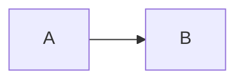

# Grill-Me: Sample

> **Instructions:** Answer inline.
>
> **Status:** Round 2 open — awaiting answers.

---

## A. Shape

### A1. Where it lives
**Importance:** High
Pick a home for it.

- (a) **Inside the app** as a tab
- (b) A separate window
- (c) A web page

**Recommendation:** (a), it reuses what exists.

**Answer:** a — only on the laptop

---

### A2. Storage
**Importance:** Low (you)
Where does the state live?



```text
### not a heading
---
```

**Visual:** grill-assets/A2/today.png "Today"
**Visual:** grill-assets/A2/option-a.html "Option a" (a)
- (a) A file
- (b) A database

**Recommendation:** (a).
Plain files are easy to diff.

**Answer:**

---

## Z. Non-functional requirements

### Z1. Any non-functional requirements?
**Importance:** Low

**Recommendation:** none.

**Answer:** reco

---

## Round 2 — follow-ups

### A1. Blocking thing
**Importance:** Blocking
Must decide.

- (a) Yes
- (b) No

**Visual requested:** a prototype of option b

**Recommendation:** (a).

**Answer:**

---

### A2. Free text
**Importance:** Medium
Tell me anything.

**Recommendation:** nothing.

**Answer:**
line one
line two

---

### A3. Untagged
No importance here.

**Recommendation:** whatever.

**Answer:**

---

## Decisions (converged)
- not a question

## When you're done
Tell me **"review"**.
